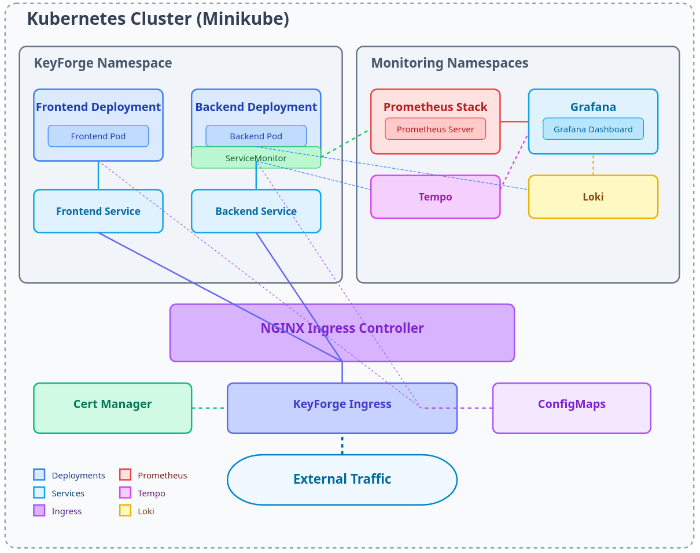

[](https://kubernetes.io/)
[](https://helm.sh/)

## 📋 Table of Contents

- [Overview](#-overview)
- [Prerequisites](#-prerequisites)
- [Architecture](#-architecture)
- [Installation Guide](#-installation-guide)
- [Accessing the Application](#-accessing-the-application)
- [Monitoring & Observability](#-monitoring--observability)
- [Troubleshooting](#-troubleshooting)
- [Resource Requirements](#-resource-requirements)
- [License](#-license)

## 🌟 Overview

Comprehensive Kubernetes deployment solution with integrated monitoring,
tracing, and logging capabilities for KeyForge project.



## 🛠 Prerequisites

- 🐳 Docker
- ☸️ kubectl v1.32+
- 🚢 Helm v3.17+
- 🚦 Minikube v1.32+ (for local development)
- 💻 8GB+ RAM available for the cluster

## 🏗 Architecture

The architecture consists of:

| Component | Description |
|-----------|-------------|
| 🌐 Frontend | React application exposed on port 3000 |
| 🔧 Backend | API service with health checks on port 8000 |
| 🔀 Ingress | NGINX ingress controller  |
| 📊 Monitoring | Prometheus & Grafana stack for metrics visualization |
| 📝 Logging | Loki for log aggregation |
| 🔍 Tracing | Tempo for distributed tracing |

## 📦 Installation Guide

### 1. Install Prerequisites

```bash
# Install kubectl
curl -LO "https://dl.k8s.io/release/$(curl -sSL https://dl.k8s.io/release/stable.txt)/bin/linux/amd64/kubectl"
sudo install -o root -g root -m 0755 kubectl /usr/local/bin/kubectl

# Install Helm
curl -L https://raw.githubusercontent.com/helm/helm/main/scripts/get-helm-3 | bash
```

### 2. Setup Minikube

```bash
minikube start \
  --driver=docker \
  --addons=default-storageclass \
  --addons=ingress \
  --addons=ingress-dns \
  --memory=8g \
  --cpus=12 \
  --nodes=1
```

### 3. Add Helm Repositories

```bash
helm repo add prometheus https://prometheus-community.github.io/helm-charts
helm repo add grafana https://grafana.github.io/helm-charts
helm repo add jetstack https://charts.jetstack.io
helm repo update
```

## 4. Install Cert Manager
```bash
helm upgrade --install cert-manager jetstack/cert-manager -n cert-manager --create-namespace --set installCRDs=true
# cd into Keyforge/kubernetes/
kubectl apply -f ./minikube-cert-manager.yaml
```

## 5. Install Prometheus+Grafana stack
```bash
kubectl create ns prometheus
kubectl create ns grafana

helm upgrade --install prometheus prometheus/kube-prometheus-stack -n prometheus --values ./prom-stack-values.yaml
```

## 6. Install Tempo
```bash
helm upgrade --install tempo grafana/tempo --namespace grafana
```

## 7. Install  Loki + Promtail
#### LOKI VERSION 2.9.3 !!!!
#### https://community.grafana.com/t/grafana-unable-to-connect-with-loki-please-check-the-server-logs-for-more-details/119757/5
```bash
helm upgrade --install loki --namespace=grafana grafana/loki-stack --set loki.image.tag=2.9.3 --values ./loki-values.yaml
```

## 8. Install the project chart
```bash
helm upgrade --install keyforge keyforge/
```

## 🔍 Accessing the Application

After installation, access:
- 🌐 Frontend: `http://keyforge.local/`
- 📊 Grafana Dashboard: `http://grafana.keyforge/`

## 📈 Monitoring & Observability

- 📊 **Metrics**: Prometheus and Grafana visualization
- 📝 **Logs**: Collected by Promtail, stored in Loki
- 🔍 **Traces**: Captured with OpenTelemetry in Tempo
- 🕵️ **Service Monitor**: Auto-discovers services with proper labels

## 🐞 Troubleshooting

### Common Issues

- **Grafana Connection**: Ensure Loki is deployed with version 2.9.3
- **Certificate Issues**: Verify cert-manager installation
- **Pod Startup Failures**: Check resource and health probe configurations


## 💻 Resource Requirements

| Component | CPU Request | Memory Request | CPU Limit | Memory Limit |
|-----------|-------------|----------------|-----------|--------------|
| Frontend  | 500m        | 512Mi          | 1000m     | 1024Mi       |
| Backend   | 500m        | 512Mi          | 1000m     | 1024Mi       |